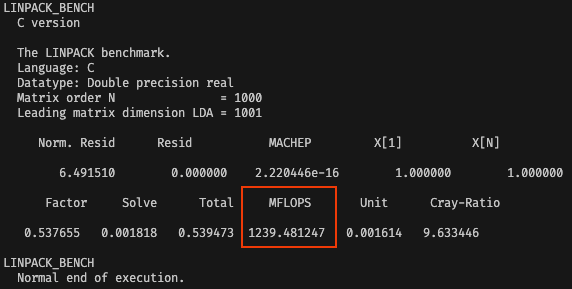

# Are They What They Claim: A Comprehensive Study of Ordinary Linear Regression Among the Top Machine Learning Libraries in Python
### by Sam Johnson, Josh Elms, Madhavan K R, Keerthana Sugasi, Parichit Sharma, Hasan Kurban and Mehmet M. Dalkilic
---
This repository was created to display supplementary materials from the above-mentioned \[[paper]()\] submitted to KDD2023. Below are steps to replicate the author's experiments in the paper. 

## Setup
To set up for a run of this pipeline, you will need to download and install the necessary libraries. Please ensure you have python >= 3.7. Determine whether you are using pip or conda (if you don't know, use the instructions for pip). 

Pip users should run:
```
pip install -r requirements.txt
```

Conda users should run:
```
conda create --name <env> --file environment.yaml
conda activate <env>
```


### To recreate 'Runtime Comparison' and 'Memory Comparison' Experiments

Both experiments are initialized, run, and analyzed together because recording runtime and recording memory usage are two very similar tasks. Details about the theory behind these experiments can be found in the paper, but we will provide steps to replicate the results on your own system.

NOTICE: The memory usage experiment relies on [Memray](https://bloomberg.github.io/memray/), which does not and is "unlikely to ever support Windows", as per their [Supported Environments](https://bloomberg.github.io/memray/supported_environments.html) page. Accordingly, this experiment does not run on Windows machines. In order to run just the time profiling (and ignore memory), a Windows user could remove the memray import and the indented blocks in which memory profiling occurs in `complexity_exper/data/complexity_experiment.py`. Additionally, the Memray works better on Linux than on Mac. Although it will function on Mac, the postprocessing notebook might throw numerous warnings/errors -- these can be ignored unless they halt program execution. Finally, the postprocessing of memory files MUST be completed on the same system which performed the experiment due to the [intricacies](https://bloomberg.github.io/memray/native_mode.html#how-memray-resolves-symbols) of Memray.

##### Steps:
1. Run the Linpack Benchmark
    1) Enter the complexity experiment's data generation directory
        ```
        cd complexity_exper/data
        ```
    2) Compile the benchmark script with [GCC](https://gcc.gnu.org/) or your preferred compiler
        ```
        gcc linpack_benchmark.c -o linpack_benchmark.out
        ```
    3) Run the benchmark 
        ```
        ./linpack_benchmark.out
        ```
    4) Record the processor speed (shown in image below) in the `MFLOPS` field of  `complexity_exper/analysis/postprocessor.ipynb`
    

2. Run the main experiment
    1) Set the initialization parameters according to their descriptions in `complexity_experiment.py`
    2) Run the experiment
        ```
        python complexity_experiment.py
        ```
    3) Move the output into `complexity_exper/analysis`
        ```
        cd ..
        mv data/complexity_results analysis/
        ```
3. Run postprocessing
    1) Set the necessary parameters in the cell "User-Defined Parameters".
    2) Run all cells sequentially. Memray processing can be quite slow on Mac, but it should finish in less than an hour.

4. Run the visualization script
    1) Set the path to the output (`complexity_results`, if you are in `complexity_exper/analysis`)
    2) Run the script
        ```
        python visualization.py
        ```
    3) See `memory_figures` and `runtime_figures` for experimental results, or `processed_output` for exact values of the trends shown in the plots.

The results shown in this paper are under `complexity_exper/analysis`. Experimental results are included for two of Indiana University's High-Performance Computing systems ([Quartz](https://kb.iu.edu/d/qrtz) and [Carbonate](https://kb.iu.edu/d/aolp)), as well as a MacBook Pro.

### To recreate 'Subsections of Circular Data' Experiment

##### Steps:

1. Run `circular_data_exper/data/create_data.py`
2. Run `circular_data_exper/analysis/run_lin_reg.py`
3. Run `circular_data_exper/analysis/aggregate_results.py`
4. Your result CSVs will be `circular_data_exper/analysis/final_results` folder and the their accompanying images will be in `circular_data_exper/analysis/regression_pics`.

To run again, delete `circular_data_exper/analysis/final_results`, `circular_data_exper/analysis/outputs`, `circular_data_exper/data/raw_data`, `circular_data_exper/analysis/regression_pics` folders and `circular_data_exper/analysis/cnt_#.txt` file. Start again with Step 1.

### To recreate 'High-Dimensional Data' Experiment

##### Steps:

1. Run `high_dimensional_exper/analysis/run_datasets.py`
2. Run `high_dimensional_exper/analysis/result_aggregation.py`

The results of this experiment are already stored in the `high_dimensional_exper/results` folder. The final CSV used in the paper is `high_dimensional_exper/results/MAE_linreg_comparison.csv`.

---

Email Joshua Elms (joshua.elms111@gmail.com) for questions.

If you find this work useful, cite it using:
```
@article{johnson2023ols,
  title={Are They What They Claim: A Comprehensive Study of Ordinary Linear Regression Among the Top Machine Learning Libraries in Python},
  author={Johnson, Sam and Elms, Josh and Kalkunte Ramachandra, Madhavan and Sugasi, Keerthana and Sharma, Parichit, and Kurban, Hasan and Dalkilic, Mehmet M.},
  year={2023}
}
```
